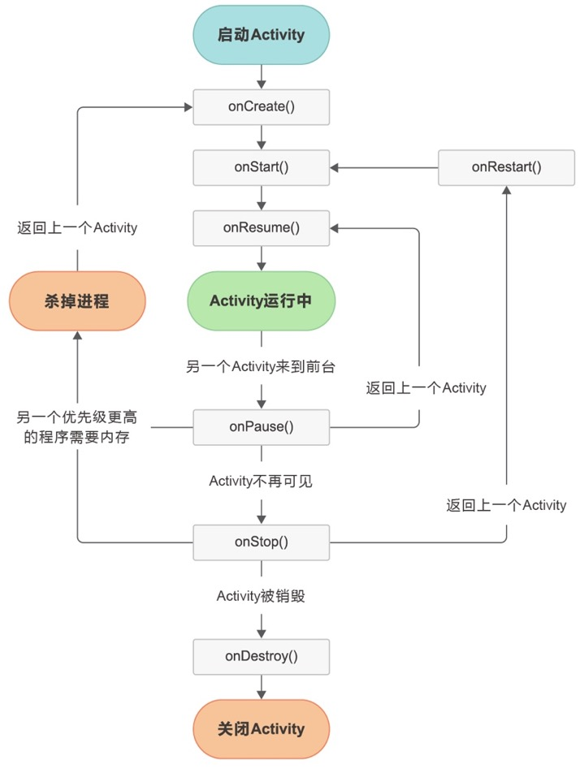
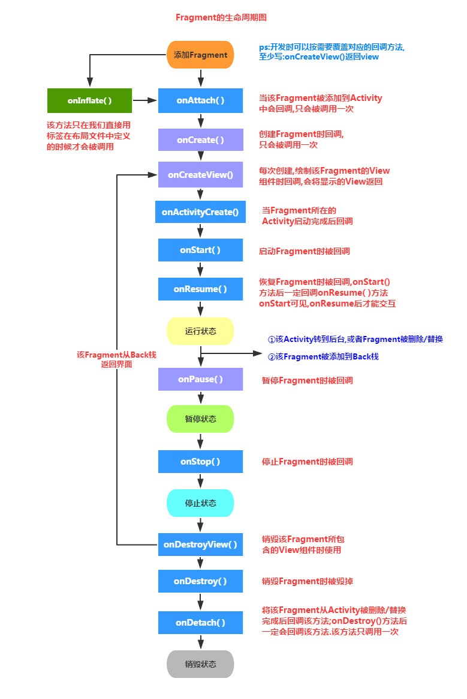

# Activity
> 负责用户界面的展示和用户交互,学习Activity就要学习Fragment，虽然它不是四大组件之一，但是它在我们的开发工作中也是频频被使用到，且必须和Activity一块使用，常用于分模块开发，比如慕课首页的几个tab,每个tab都是对应着一个Fragment.

## onCreate()
>该方法会在 Activity 第一次创建时进行调用，在这个方法中通常会做 Activity 初始化相关的操作，例如：加载布局、绑定事件等。

## onStart()
>这个方法会在 Activity 由不可见变为可见的时候调用，但是还不能和用户进行交互。

## onResume()
>表示Activity已经启动完成，进入到了前台，可以同用户进行交互了。

## onPause()
>这个方法在系统准备去启动另一个 Activity 的时候调用。可以在这里释放系统资源，动画的停止，不宜在此做耗时操作。

## onStop()
>当Activity不可见的时候回调此方法。需要在这里释放全部用户使用不到的资源。可以做较重量级的工作，如对注册广播的解注册，对一些状态数据的存储。此时Activity还不会被销毁掉，而是保持在内存中，但随时都会被回收。通常发生在启动另一个Activity或切换到后台时

## onDestroy()
>Activity即将被销毁。此时必须主动释放掉所有占用的资源。

## onRestart()
>这个方法在 Activity 由停止状态变为运行状态之前调用，也就是 Activity 被重新启动了（APP切到后台会进入onStop(), 再切换到前台时会触发onRestart()方法）
+ 四大组件需要在AndroidManifest文件中配置否则无法使用，类似Activity无法启动，
+ 一般情况下： 在新建一个activity后，为了使intent可以调用此活动，我们要在androidManifest.xml文件中添加一个标签，标签的一般格式如下：
```xml
<activity
            android:name=".MainActivity"
            android:label="@string/app_name">
            <intent-filter>
                <action android:name="android.intent.action.MAIN" />
                <category android:name="android.intent.category.LAUNCHER" />
            </intent-filter>
  </activity>
```
+ android:name是对应Activity的类名称
+ android:label是Activity标题栏显示的内容. 现已不推荐使用
+ 是意图过滤器. 常用语隐式跳转
+ 是动作名称，是指intent要执行的动作
+ 是过滤器的类别 一般情况下，每个 中都要显示指定一个默认的类别名称，即<category android:name="android.intent.category.DEFAULT" />
+ 其中的是"android.intent.action.MAIN"，意思是这个Activity是应用程序的入口点，这种情况下可以不加默认类别名称。
## Activity启动与参数传递
### 1. 显式启动：通过包名来启动
- 最常见的：startActivity
```kotlin
//①:常规跳转
val intent = Intent(MainActivity.this,SecondActivity.class)
startActivity(intent);

//②:携带参数启动新Activity
val intent = Intent(MainActivity.this,SecondActivity.class)
intent.putExtra("extra_data", "extra_data")
intent.putExtra("extra_int_data", 100)
startActivity(intent);
```
- 期待从目标页获取数据：startActivityForResult---->比如启动相册获取图片
```kotlin
//①假设从A--->B页面，以startActivityForResult方式启动
val intent = Intent(MainActivity.this, SecondActivity.class)
startActivityForResult(intent, 100);

//②如果B页面返回时，调用了 
setResult(Activity.RESULT_OK,resultIntent)
finish()

//③则A页面会回调下面的方法,在该回调里可以拿到返回的数据data
onActivityResult(requestCode: Int, resultCode: Int, data: Intent?)
```
### 2. 隐式启动
- 隐式 Intent 要比显示 Intent 含蓄的多，他并不明确指定要启动哪个 Activity，而是通过指定 action 和 category 的信息，让系统去分析这个 Intent，并找出合适的 Activity 去启动。
```xml
 <activity android:name=".SecondActivity">
     <intent-filter>
         <action android:name="com.example.firstapp.action.SecondActivity" />
         <category android:name="com.example.firstapp.category.SecondActivity" />
         <category android:name="android.intent.category.DEFAULT" /> // 一定要有
     </intent-filter>
</activity>
```
```kotlin
val intent = Intent()
intent.setAction("com.example.firstapp.action.SecondActivity")
intent.setCategory("com.example.firstapp.category.SecondActivity")

intent.putExtra("extra_data", "extra_data")
intent.putExtra("extra_int_data", 100)
startActivity(intent);

startActivityForResult(intent,100);
```
## 系统给我们提供的一些常见的Activtiy
### 拨打电话
```kotlin
//给移动客服10086拨打电话
Uri uri = Uri.parse("tel:10086");
Intent intent = new Intent(Intent.ACTION_DIAL, uri);
startActivity(intent);
```
### 发送短信
```kotlin
//给10086发送内容为“Hello”的短信 
Uri uri = Uri.parse("smsto:10086");
Intent intent = new Intent(Intent.ACTION_SENDTO, uri);
intent.putExtra("sms_body", "Hello");
startActivity(intent);
```
### 打开浏览器:
```kotlin
//打开baidu主页 
Uri uri = Uri.parse("http://www.baidu.com");
Intent intent  = new Intent(Intent.ACTION_VIEW, uri);
startActivity(intent);
```
### 多媒体播放:
```kotlin
Intent intent = new Intent(Intent.ACTION_VIEW);
Uri uri = Uri.parse("file:///sdcard/foo.mp3");
intent.setDataAndType(uri, "audio/mp3");
startActivity(intent);
```
### 打开摄像头拍照:
```kotlin
Intent intent = new Intent(MediaStore.ACTION_IMAGE_CAPTURE);
startActivityForResult(intent, 0);

// 在Activity的onActivityResult方法回调中取出照片数据
Bundle extras = intent.getExtras();
Bitmap bitmap = (Bitmap) extras.get("data");
```
### 从图库选图并剪切
```kotlin
// 获取并剪切图片
Intent intent = new Intent(Intent.ACTION_GET_CONTENT);
intent.setType("image/*");
intent.putExtra("crop", "true"); // 开启剪切
intent.putExtra("aspectX", 1); // 剪切的宽高比为1：2
intent.putExtra("aspectY", 2);
intent.putExtra("outputX", 20); // 保存图片的宽和高
intent.putExtra("outputY", 40);
intent.putExtra("output", Uri.fromFile(new File("/mnt/sdcard/temp"))); // 保存路径
intent.putExtra("outputFormat", "JPEG");// 返回格式
startActivityForResult(intent, 0);

//  在Activity的onActivityResult方法中去读取保存的文件
```
### 剪切指定图片文件
```kotlin
Intent intent = new Intent("com.android.camera.action.CROP");
intent.setClassName("com.android.camera", "com.android.camera.CropImage");
intent.setData(Uri.fromFile(new File("/mnt/sdcard/temp")));
intent.putExtra("outputX", 1); // 剪切的宽高比为1：2
intent.putExtra("outputY", 2);
intent.putExtra("aspectX", 20); // 保存图片的宽和高
intent.putExtra("aspectY", 40);
intent.putExtra("scale", true);
intent.putExtra("noFaceDetection", true);
intent.putExtra("output", Uri.parse("file:///mnt/sdcard/temp"));
startActivityForResult(intent, 0);

// 在Activity的onActivityResult方法中去读取保存的文件
```
### 进入手机的无线网络设置页面
```kotlin
// 进入无线网络设置界面（其它可以举一反三）  
Intent intent = new Intent(android.provider.Settings.ACTION_WIRELESS_SETTINGS);  
startActivityForResult(intent, 0);
```
## Activity四种启动模式
### standard
默认值，多实例模式。每启动一次，都会创建一个新的Activity实例。
启动的生命周期为：onCreate()->onStart()->onResume()
### singleTop
栈顶复用模式
如果任务栈顶已经存在需要启动的目标Activity，则直接启动，并会回调onNewIntent()方法，生命周期顺序为： onPause() ->onNewIntent()->onResume()
如果任务栈上顶没有需要启动的目标Activity，则创建新的实例，此时生命周期顺序为： onCreate()->onStart()->onResume()
### singleTask
栈内复用模式，一个任务栈只能有一个实例。
- 有几种情况：
+ 当启动的Activity目标任务栈不存在时，则以此启动Activity为根Activity创建目标任务栈，并切换到前面
+ 当启动的Activity存在时，则会直接切换到Activity所在的任务栈，并且任务栈中在Activity上面的所有其他Activity都出栈（调用destroy()），此时启动的Activity位于任务栈顶，并且会回调onNewIntent()方法。
### singleInstance
singleInstance名称是单例模式，即App运行时，该Activity只有一个实例。既然只有一个，那么也就说明很重要、很特殊，我们需要将其“保护起来”。单例模式的“保护措施”是将其单独放到一个任务栈中。

## Intent FLag设定启动模式
除了可以在manifest中设置Activity的启动模式，也可以通过设置Intent的flag标识来设定Activity的启动模式。
常用的有：FLAG_ACTIVITY_NEW_TASK，FLAG_ACTIVITY_SINGLE_TOP，FLAG_ACTIVITY_CLEAR_TOP
- FLAG_ACTIVITY_NEW_TASK
+ 启动Activity时，如果不存在Activity的实例，则会以此Activity为根Activity创建新的任务栈，如果存在的话则直接切换到对应的Activity实例，并回调onNewIntent()方法。相当于“singleTask”启动模式。

- FLAG_ACTIVITY_SINGLE_TOP
+ 相当于“singleTop”模式

- FLAG_ACTIVITY_CLEAR_TOP
+ 设置此标识的Activity在启动时，如果当前的任务栈内存在此Activity实例，则跳转到此实例，并清除掉在此实例上面的所有Activity实例，此时此Activity实例位于任务栈的栈顶

## Fragment
Fragment并不能单独使用，他需要嵌套在Activity 中使用，尽管他拥有自己的生命周期，但是还是会受到宿主Activity的生命周期的影响，比如Activity 被destory销毁了，他也会跟着销毁！一个Activity可以嵌套多个Fragment。

- Activity加载Fragment的时候,依次调用下面的方法: onAttach -> onCreate -> onCreateView -> onActivityCreated -> onStart ->onResume
- 当我们启动一个新的页面, 此时Fragment所在的Activity不可见，会执行 onPause
- 当新页面返回后，当前Activity和Fragment又可见了，会再次执行onStart和 onResume
- 退出了Activity的话,那么Fragment将会被完全结束, Fragment会进入销毁状态 onPause -> onStop -> onDestoryView -> onDestory -> onDetach
### 动态添加Fragment
```kotlin
// 定义StudyFragment需要继承自Fragment，并且绑定布局文件
class StudyFragment : Fragment(R.layout.fragment_study,container) {

}   

// 在Activity中使用supportFragmentManager管理Fragment,添加到界面上
class MainActivity:AppCompactActivity{
   override fun onCreate(savedInstanceState: Bundle?) {
        val studyFragment =  StudyFragment();
        val bundle = Bundle()
        bundle.putInt()
        studyFragment.argments= Bundle
        supportFragmentManager.beginTransaction()
           .add(R.id.container, studyFragment).commitAllowingStateLoss()
   }
}
```
### Fragment常见的操作
```kotlin
val fragment = StudyFragment()
val ft = supportFragmentManager.beginTransaction()

if(!fragment.isAdded()){
  ft.add(R.id.container,fragment) //把fragment添加到事务中，当且仅当该fragment未被添加过
}
ft.show(fragment) //显示出fragment的视图
ft.hide(fragment) //隐藏fragment,使得它的视图不可见
ft.remove(fragment)//移除fragment
ft.replace(R.id.container,fragment)//替换fragment,之前添加过的fragment都会被暂时移除，把当前这个fragment添加到事务中

ft.commitAllowingStateLoss()//提交事务，执行对fragment的add、replace、show、hide操作
```
### 给Fragment传递数据
```kotlin
class MainActivity:AppcompactActivity{

     override fun onCreate(savedInstanceState: Bundle?){

       val studyFragment =  StudyFragment();

       // 创建bundle对象、并填充数据赋值给fragment的argments字段
       val bundle = Bundle()
       bundle.putInt("key_int",100)
       bundle.putString("key_string","key_string_value")
       studyFragment.argments= Bundle

       supportFragmentManager.beginTransaction().add(R.id.container,    studyFragment).commitAllowingStateLoss()

     }
}

class StudyFragment : Fragment(R.layout.fragment_study) {
    override fun onViewCreated(view: View, savedInstanceState: Bundle?) {
        // 取出参数
        val intArgument = argments?.getInt("key_int")
        val stringArgument = argments?.getInt("key_string")
    }
}
```
# Service服务
> 不需要和用户交互，负责后台任务，比如播放音乐，socket长连接
> Service启动后默认是运行在主线程中,在执行具体耗时任务过程中要手动开启子线程,应用程序进程被杀死,所有依赖该进程的Service服务也会停止运行。
> Service是四大组件之一，同样需要在AndroidManifest中注册后，才能使用.
[Servcie必知必会.png](./imgs/Servcie必知必会.png)
[service.jpeg](./imgs/service.jpeg)

### 普通启动startService()
- ①首次启动会创建一个Service实例,依次调用onCreate()和onStartCommand()方法,此时Service 进入运行状态

- ②如果再次调用StartService启动Service,将不会再创建新的Service对象, 系统会直接复用前面创建的Service对象,调用它的onStartCommand()方法！

- ③这样的Service与它的调用者无必然的联系,就是说当调用者结束了自己的生命周期, 但是只要不调用stopService,那么Service还是会继续运行的!

- ④无论启动了多少次Service,只需调用一次StopService即可停掉Service

#### 定义Service服务
```kotlin
class TestService : Service() {
    private val TAG = "TestService1"

    //必须要实现的方法  
    override fun onBind(intent: Intent?): IBinder? {
        Log.e(TAG, "onBind方法被调用!")
        return null
    }

    //Service被创建时调用  
    override fun onCreate() {
        Log.e(TAG, "onCreate方法被调用!")
        super.onCreate()
    }

    //Service被启动时调用  
    override fun onStartCommand(intent: Intent?, flags: Int, startId: Int): Int {
        Log.e(TAG, "onStartCommand方法被调用!")
        return super.onStartCommand(intent, flags, startId)
    }

    //Service被关闭之前回调  
    override fun onDestroy() {
        Log.e(TAG, "onDestory方法被调用!")
        super.onDestroy()
    }
}
```
#### AndroidManifest.xml完成Service注册
```xml
<application>
     <service android:name=".components.TestService1">        
     </service>
</application>
```
#### 在Avtivity中StartService启动服务
```kotlin
val intent = Intent(this,TestService1::class.java);   
startService(intent);
```
### 绑定启动bindService()
- ①当首次使用bindService()启动一个Service时,系统会实例化一个Service实例,并调用其onCreate()和onBind()方法,然后调用者就可以通过返回的IBinder对象和Service进行交互了,此后如果我们再次使用bindService绑定Service,系统不会创建新的Sevice实例,也不会再调用onBind()方法,只会直接把IBinder对象返回给调用方

- ②如果我们解除与服务的绑定,只需调用unbindService(),此时onUnbind和onDestory方法将会被调用

- ③bindService启动的Service服务是与调用者(Activity)相互关联的,可以理解为 "一条绳子上的蚂蚱",要死一起死,在bindService后,一旦调用者(Activity)销毁,那么Service也立即终止
#### 定义Service服务
```kotlin
class TestService2 : Service() {
    private val TAG = "TestService2"
    private var count = 0
    private var quit = false

    //定义onBinder方法所返回的对象  
    private val binder: MyBinder = MyBinder()

    inner class MyBinder : Binder() {
        fun getCount(): Int {
            return count
        }
    }

    //必须实现的方法,绑定改Service时回调该方法  
    override fun onBind(intent: Intent?): IBinder {
        Log.e(TAG, "onBind方法被调用!")
        return binder
    }

    //Service被创建时回调  
    override fun onCreate() {
        super.onCreate()
        Log.e(TAG, "onCreate方法被调用!")
        //创建一个线程动态地修改count的值  
        object : Thread() {
            override fun run() {
                while (!quit) {
                    try {
                        sleep(1000)
                    } catch (e: InterruptedException) {
                        e.printStackTrace()
                    }
                    count++
                }
            }
        }.start()
    }

    //Service断开连接时回调  
    override fun onUnbind(intent: Intent?): Boolean {
        Log.i(TAG, "onUnbind方法被调用!")
        return true
    }

    //Service被关闭前回调  
    override fun onDestroy() {
        super.onDestroy()
        quit = true
        Log.i(TAG, "onDestroyed方法被调用!")
    }

    override fun onRebind(intent: Intent?) {
        Log.i(TAG, "onRebind方法被调用!")
        super.onRebind(intent)
    }
}
```
#### AndroidManifest.xml中注册服务
```xml
<application>
     <service android:name=".components.TestService2">        
     </service>
</application>
```
#### 在Activity中bindService启动服务
```kotlin
//保持所启动的Service的IBinder对象,同时定义一个ServiceConnection对象
        val conn: ServiceConnection = object : ServiceConnection {
            //Activity与Service断开连接时回调该方法
            override fun onServiceDisconnected(name: ComponentName) {
                println("------Service DisConnected-------")
            }

            //Activity与Service连接成功时回调该方法
            override fun onServiceConnected(name: ComponentName, service: IBinder) {
                println("------Service Connected-------")
                binder = service as MyBinder
            }
        }

        // bind服务
        val intent = Intent(this,TestService::class.java)
        bindService(intent,conn,Context.BIND_AUTO_CREATE)
        start_service.setOnClickListener {
            // 从服务获取数据
            Log.e("TestService2","getCount:${binder?.getCount()}")
        }

        // 停止按钮
        stop_service.setOnClickListener {
            unbindService(conn)
        }
```
### Android 8.0及以上不允许后台启动Service服务
在一加手机上，用户升级了新版8.0的系统，用户将app切到后台，过一会儿就弹出“xxx app 已停止运行”的弹窗。
通过定位分析，发现下面俩前置条件
8.0系统杀服务杀的很频繁
1. 为了保活，我们使用了俩Service互保的方式
2. 马上跑了26的模拟器，果然复现，日志如下：
```text
Process: com.example.firstapp, PID: 10510
    java.lang.IllegalStateException: Not allowed to start service Intent { cmp=com.example.firstapp/.components.TestService }: app is in background uid UidRecord{adece9d u0a77 LAST bg:+1m35s61ms idle procs:1 seq(0,0,0)}
        at android.app.ContextImpl.startServiceCommon(ContextImpl.java:1505)
        at android.app.ContextImpl.startService(ContextImpl.java:1461)
        at android.content.ContextWrapper.startService(ContextWrapper.java:644)
        at android.content.ContextWrapper.startService(ContextWrapper.java:644)
        at com.example.firstapp.components.TestServiceActivity$onCreate$1.run(TestServiceActivity.kt:26)
```
- Android 8.0 还对特定函数做出了以下变更：
 + 如果针对 Android 8.0 的应用尝试在不允许其创建后台服务的情况下使用 startService() 函数，则该函数将引发一个 IllegalStateException。
 + 新的 Context.startForegroundService() 函数将启动一个前台服务。现在，即使应用在后台运行，系统也允许其调用 Context.startForegroundService()。不过，应用必须在创建服务后的五秒内调用该服务的 startForeground() 函数。
- 解决方法就很简单了，把Service互启的逻辑块改为：
- AndroidManifest.xml声明权限
```xml
<uses-permission android:name="android.permission.FOREGROUND_SERVICE" />
```
- 服务启动兼容写法
```kotlin
if (Build.VERSION.SDK_INT >= 26) {
    context.startForegroundService(intent);
} else {
    // Pre-O behavior.
    context.startService(intent);
}


class TestService:Service(){
  // 发送一个前台通知
  override fun onCreate(){
       val notification: Notification =Notification.Builder(applicationContext, "channel_id").build()
       startForeground( 1, notification)
  }
}
```
- 在被启动的Service创建服务后的五秒内调用startForground(0, new Notification())，如果不调用或调用时间超过5秒会抛出一个ANR。
# BroadcastReceiver广播接收者
> 负责页面间通信，系统和APP通信，APP和APP通信，比如监听网络连接状态变化，就是通过BroadcastReceiver广播接收者来实现的
> BroadcastReceiver广播接收者Android四大组件之一，是Android系统提供的一种通讯方式。
## 两种广播类型
    标准广播：发出广播后，该广播事件的接收者，几乎会在同一时刻收到通知，都可以响应或不响应该事件
    有序广播：发出广播后，同一时刻，只有一个广播接收者能收到、一个接收者处理完后之后，可以选择继续向下传递给其它接收者，也可以拦截掉广播。[不常用、不推荐使用了]
## 监听系统网络连接变化
### 定义一个广播接收者
```kotlin
// 监听网络连接状态的变化，并toast提示
class TestBroadcastReceiver : BroadcastReceiver() {
    override fun onReceive(context: Context?, intent: Intent?) {
       if (intent?.action?.equals(ConnectivityManager.CONNECTIVITY_ACTION)==true){
            val connectivityManager:ConnectivityManager = context?.getSystemService(Context.CONNECTIVITY_SERVICE) as ConnectivityManager
            val info = connectivityManager.activeNetworkInfo
            if(info != null && info.isAvailable) {
                val typeName = info.typeName
                Toast.makeText(context,"当前网络名称:${typeName}",Toast.LENGTH_LONG).show()
            } else {
                Toast.makeText(context,"当前无网络连接",Toast.LENGTH_LONG).show()
            }
        }
    }
}
```
### 运行时动态注册广播接收事件
```kotlin
class TestBroadcastRecevierActivity :AppCompatActivity(){
    private lateinit var myReceiver: TestBroadcastReceiver

    override fun onCreate(savedInstanceState: Bundle?) {
        super.onCreate(savedInstanceState)

        myReceiver = TestBroadcastReceiver()
        // 创建广播过滤器，指定只接收android.net.conn.CONNECTIVITY_CHANGE的广播事件
        val intentFilter = IntentFilter() 
        intentFilter.addAction(Intent.ACTION_CONFIGURATION_CHANGED)
        registerReceiver(myReceiver, intentFilter)
    }

    override fun onDestroy() {
        super.onDestroy()
        unregisterReceiver(myReceiver)   // 必须要在onDestroy时反注册，否则会内存泄漏
    }
}
```
>不要在收到广播后进行任何耗时操作,因为在广播中是不允许开辟线程的, 当onReceiver( )方法运行较长时间(超过10秒)还没有结束的话,那么程序会报错(ANR), 广播更多的时候扮演的是一个打开其他组件的角色,比如启动Service,Notification提示, Activity等！

### 静态注册广播
```xml
<!--AndroidManifest.xml中注册广播-->
<receiver android:name=".components.TestBroadcastReceiver">
     <intent-filter >
          <action android:name="android.net.conn.CONNECTIVITY_CHANGE"/>
     </intent-filter>
</receiver>
```
```text
Google官方声明：Beginning with Android 8.0 (API level 26), the system imposes additional restrictions on manifest-declared receivers. If your app targets API level 26 or higher, you cannot use the manifest to declare a receiver for most implicit broadcasts (broadcasts that do not target your app specifically). 大概意思就是说：从android 8.0（API26）开始，对清单文件中静态注册广播接收者增加了限制，建议大家不要在清单文件中静态注册广播接收者。

其实说白点：就是因为在清单文件中静态注册广播接收者，容易让一些"不法分子"获取用户的隐私(如：电话监听、短信监听等等)，所以google限制了静态注册（Android在保护用户隐私上坚持不懈的努力着...也许google还要其他的考虑吧。咱也不知道...咱也不敢问😁）
```
### 解决静态注册广播接收者收不到事件的问题
```kotlin
//虽然从Android8.0开始，系统明确限制了静态广播注册去监听系统行为，但是应用自己定义的的广播事件还是可以使用静态注册的
val intent= Intent();
intent.action = "com.example.firstapp.TEST_BROADCAST_RECEVIER";

// 下面这一行在Android 7.0及以下版本不是必须的，但是Android 8.0或者更高版本，发送广播的条件更加严苛，必须添加这一行内容。
// 创建的ComponentName实例化对象有两个参数，第1个参数是指接收广播类的包名，第2个参数是指接收广播类的完整类名。
intent.component =ComponentName(packageName,"com.example.firstapp.component.TEST_BROADCAST_RECEVIER")

sendBroadcast(intent)
```
## 发送自定义事件广播
### 全局发送广播
```kotlin
//全局发送广播，如果别人家App也注册了该事件监听，也能收到，比较不合理。

sendBroadcast(new Intent("com.example.firstapp.component.TEST_BROADCAST_RECEVIER"));
```
### 应用内发送广播
```kotlin
//App应用内广播可理解为一种局部广播，广播的发送者和接收者都同属于一个App。
//相比于全局广播（普通广播），App应用内广播优势体现在：安全性高 & 效率高
// 使用LocalBroadcastManager来注册应用内广播
LocalBroadcastManager.getInstance(this).registerReceiver(myReceiver, itFilter)

// 使用LocalBroadcastManager来发送应用内广播
LocalBroadcastManager.getInstance(this).sendBroadcast(intent)
```
## 系统广播（System Broadcast）
    Android中内置了多个系统广播：只要涉及到手机的基本操作（如开机、网络状态变化、拍照等等），都会发出相应的广播
    每个广播都有特定的Intent - Filter（包括具体的action），Android系统广播action如下：
| 系统操作                                       | 	action                              |
|:-------------------------------------------|:-------------------------------------|
| 监听网络变化	                                    | android.net.conn.CONNECTIVITY_CHANGE |
| 关闭或打开飞行模式                                  | 	Intent.ACTION_AIRPLANE_MODE_CHANGED |
| 充电时或电量发生变化                                 | 	Intent.ACTION_BATTERY_CHANGED       |
| 电池电量低                                      | 	Intent.ACTION_BATTERY_LOW           |
| 电池电量充足（即从电量低变化到饱满时会发出广播                    | 	Intent.ACTION_BATTERY_OKAY          |
| 系统启动完成后(仅广播一次)                             | 	Intent.ACTION_BOOT_COMPLETED        |
| 按下照相时的拍照按键(硬件按键)时                          | 	Intent.ACTION_CAMERA_BUTTON         |
| 屏幕锁屏                                       | 	Intent.ACTION_CLOSE_SYSTEM_DIALOGS  |
| 设备当前设置被改变时(界面语言、设备方向等)                     | 	Intent.ACTION_CONFIGURATION_CHANGED |
| 插入耳机时                                      | 	Intent.ACTION_HEADSET_PLUG          |
| 未正确移除SD卡但已取出来时(正确移除方法:设置--SD卡和设备内存--卸载SD卡) | 	Intent.ACTION_MEDIA_BAD_REMOVAL     |
| 插入外部储存装置（如SD卡）                             | 	Intent.ACTION_MEDIA_CHECKING        |
| 成功安装APK                                    | 	Intent.ACTION_PACKAGE_ADDED         |
| 成功删除APK                                    | 	Intent.ACTION_PACKAGE_REMOVED       |
| 重启设备                                       | 	Intent.ACTION_REBOOT                |
| 屏幕被关闭                                      | 	Intent.ACTION_SCREEN_OFF            |
| 屏幕被打开                                      | 	Intent.ACTION_SCREEN_ON             |
| 关闭系统时                                      | 	Intent.ACTION_SHUTDOWN              |
| 重启设备                                       | 	Intent.ACTION_REBOOT                |
# ContentProvider内容提供者
> 负责数据存取，常用于APP进数据共享，跨进程数据存取等....比如读取相册，读取联系人，都是ContentProvider来实现的
[ContentProvider](./imgs/ContentProvider.png)
## 权限申请
>从android6.0开始，凡是涉及用户隐私的权限(读写短信，读写联系人，拍摄，录音等等)，都需要运行时申请，弹窗提醒用户是否授权。用户不授权则无法继续操作，而且今年工信部对于违规收集，申请用户权限的APP查的非常严格，不定期抽查，抽查有问题的必须按期整改，否则强制下架。
```xml
<!--首先在AndroidManifest.xml中声明读取短信的权限-->
<uses-permission android:name="android.permission.READ_CONTACTS"/>
```
>运行时动态申请权限，请求用户授权
+ ActivityCompat.checkSelfPermission()：检查权限是否已授权，如果没授权则需要向用户申请
+ ActivityCompat.requestPermissions()：发起权限申请,会弹出对话框
+ ActivityCompat.shouldShowRequestPermissionRationale(): 检查用户是否已经永久拒绝，如果用户已永久拒绝某个权限的申请，即便再调用ActivityCompat.requestPermissions，系统也不会弹框向用户申请了。此时需要自己弹对话框，引导用户去开启授权
+ onRequestPermissionsResult：处理权限授权的结果
+ 完整的权限申请案例
```kotlin

class PermissionActivity : AppCompatActivity() {
override fun onCreate(savedInstanceState: Bundle?) {
super.onCreate(savedInstanceState)

        if (ActivityCompat.checkSelfPermission(this,
                android.Manifest.permission.READ_SMS
            ) != PackageManager.PERMISSION_GRANTED) {
            ActivityCompat.requestPermissions( this, arrayOf(android.Manifest.permission.READ_SMS),100)
        } else {
            // 如果已授权则可以直接读取通讯录了
            getContacts()
        }
    }


    override fun onRequestPermissionsResult(
        requestCode: Int,
        permissions: Array<out String>,
        grantResults: IntArray
    ) {
        super.onRequestPermissionsResult(requestCode, permissions, grantResults)
         // 处理权限申请的结果
        if (requestCode==100&&permissions[0]== android.Manifest.permission.READ_SMS){
            if (grantResults[0]==PackageManager.PERMISSION_GRANTED){
                 // 如果请求结果是授权了，则可以继续操作
                 getContacts()
            }else{
                // 如果本次申请权限，未得到授权，则toast提示，终止读取的操作。
                Toast.makeText(this, "通讯录权限被拒绝，无法读取联系人", Toast.LENGTH_SHORT).show()
            }
        }
    }
}
```
### 读取通讯录联系人
| 表名                                         | 	说明        |
|:-------------------------------------------|:-----------|
| content://com.android.contacts/data/phones | 读取联系人的表的名字 |

| 字段	          | 说明  |
|:-------------|:----|
| display_name | 用户名 |
| Data1        | 手机号 |
```kotlin
 fun getContacts() {
        //①查询raw_contacts表获得联系人的id
        val resolver = contentResolver
        val uri =Uri.parse("content://com.android.contacts/data/phones")
        //查询联系人数据
        val cursor = resolver.query(uri, null, null, null, null)!!
        while (cursor.moveToNext()) {
            //获取联系人姓名,手机号码
            val cName: String =
                cursor.getString(cursor.getColumnIndex(ContactsContract.CommonDataKinds.Phone.DISPLAY_NAME))
            val cNum: String =
                cursor.getString(cursor.getColumnIndex(ContactsContract.CommonDataKinds.Phone.NUMBER))
            Log.e("ContentProvider", "姓名:$cName")
            Log.e("ContentProvider", "号码:$cNum")
            Log.e("ContentProvider", "======================")
        }
        cursor.close()
    }
```
### 通信录插入联系人
+ AndroidManifest.xml声明权限
```xml

<uses-permission android:name="android.permission.WRITE_CONTACTS"/>
```
+ 插入联系人

| 表名                                               | 说明           |
|:-------------------------------------------------|:-------------|
| content://com.android.contacts/data/data         | 插入联系人的表的名字   |
| content://com.android.contacts/data/raw_contacts | 插入联系人的原始表的名字 |

```kotlin
fun insertContact() {
        val values = ContentValues()
        /*
         * 首先向RawContacts.CONTENT_URI执行一个空值插入，目的是获得系统返回的rawContactId
         * 这时后面插入data表的数据，才能使插入的联系人在通讯录里面可见
         */
        val rawContactUri: Uri = contentResolver!!.insert(RawContacts.CONTENT_URI, values)!!
        val rawContactId = ContentUris.parseId(rawContactUri)

        //往data表里写入姓名数据
        values.clear()
        values.put(ContactsContract.Data.RAW_CONTACT_ID, rawContactId)
        values.put(ContactsContract.Data.MIMETYPE, StructuredName.CONTENT_ITEM_TYPE) //内容类型
        values.put(StructuredName.GIVEN_NAME, "李四")
        contentResolver.insert(ContactsContract.Data.CONTENT_URI, values)

        //往data表里写入电话数据
        values.clear()
        values.put(ContactsContract.Data.RAW_CONTACT_ID, rawContactId)
        values.put(ContactsContract.Data.MIMETYPE, Phone.CONTENT_ITEM_TYPE)
        values.put(Phone.NUMBER, "13921009789")
        values.put(Phone.TYPE, Phone.TYPE_MOBILE)
        contentResolver.insert(ContactsContract.Data.CONTENT_URI, values)

        //往data表里写入Email的数据
        values.clear()
        values.put(ContactsContract.Data.RAW_CONTACT_ID, rawContactId)
        values.put(ContactsContract.Data.MIMETYPE, Email.CONTENT_ITEM_TYPE)
        values.put(Email.DATA, "lisi@qq.com")
        values.put(Email.TYPE, Email.TYPE_WORK)
        contentResolver
            .insert(ContactsContract.Data.CONTENT_URI, values)
    }
```
### 更新联系人信息
+ 根据手机号获取联系人在通讯录的contact_id
```kotlin
fun getContactIdByPhone(phone:Long): String {
        val uri =Uri.parse("content://com.android.contacts/data/phones/filter/$phone")
        val cursor = contentResolver.query(
            uri,
            arrayOf(ContactsContract.Data.CONTACT_ID),
            null,
            null,
            null
        )!! 
        if (cursor.moveToFirst()) {
            return cursor.getString(0)
        }
        return ""
    }
```
+ 更新联系人的姓名
```kotlin
fun update(){
   val contact_id = getContactIdByPhone(100001)
   val values = ContentValues()
   values.put(ContactsContract.Data.MIMETYPE,
            ContactsContract.CommonDataKinds.StructuredName.CONTENT_ITEM_TYPE
        ) //内容类型
        values.put(ContactsContract.CommonDataKinds.StructuredName.GIVEN_NAME, "lisi")
        contentResolver.update(
            Uri.parse("content://com.android.contacts/data"),
            values,
            "${ContactsContract.Data.CONTACT_ID}=?",
            arrayOf(contact_id)
        )
}
```
### 删除联系人
+ 根据姓名删除联系人
```kotlin
contentResolver.delete(RawContacts.CONTENT_URI,CommonDataKinds.Phone.DISPLAY_NAME+"=?", arrayOf("test"));
```
+ 根据手机号删除联系人
```kotlin
val contact_id = getContactIdByPhone(1111)

contentResolver.delete(RawContacts.CONTENT_URI,CommonDataKinds.Phone.CONTACT_ID+"=?", arrayOf(contact_id));
```
### 读取收件箱所有短信
| 字段        | 	说明                                   |
|:----------|:--------------------------------------|
| address	  | 发件人地址，即手机号，如+8613811810000            |
| person	   | 发件人地址，即手机号，如+8613811810000            |
| date	     | 日期，long型，如1256539465022，可以对日期显示格式进行设置 |
| protocol	 | 协议0 ：SMS_RPOTO短信，1:MMS_PROTO彩信        |
| read	     | 是否阅读0:未读，1:已读                         |
| type	     | 短信类型1: 接收到的短信，2:发出的短信                 |
| body	     | 短信具体内容                                |
```kotlin
fun getMsgs() {
        val uri: Uri = Uri.parse("content://sms/")
        val resolver = contentResolver
        //获取的是哪些列的信息
        val cursor: Cursor = resolver.query(
            uri,
            arrayOf("address", "date", "type", "body"),
            null,
            null,
            null
        )!!
        while (cursor.moveToNext()) {
            val address: String = cursor.getString(0)
            val date: String = cursor.getString(1)
            val type: String = cursor.getString(2)
            val body: String = cursor.getString(3)
            Log.e("ContentProvider", "地址:$address")
            Log.e("ContentProvider", "时间:$date")
            Log.e("ContentProvider", "类型:$type")
            Log.e("ContentProvider", "内容:$body")
            Log.e("ContentProvider", "======================")
        }
        cursor.close()
    }
```
```text
note: 
短信相关的其它操作uri

content://sms/ 所有短信

content://sms/inbox 收件箱

content://sms/sent 已发送

content://sms/draft 草稿

content://sms/outbox 发件箱

content://sms/failed 发送失败

content://sms/queued 待发送列表
```