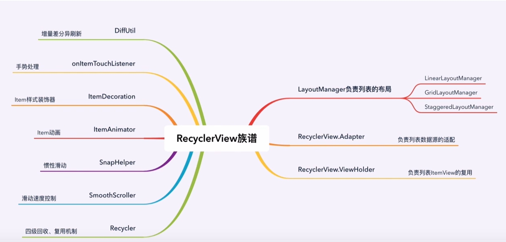

# AndroidUI基础容器
- Android的ui可以分为两类，一类叫做ViewGroup容器，一类叫做View视图
    + Views视图：（TextView,Button,ImageView）都是常用常见的视图
    + ViewGroup容器：内部可以承载，放置，添加View视图
## LinearLayout线性布局
- 横着或竖着按顺序排序
- android:gravity="center_horizontal" 使得子View在水平/横向方向上居中显示
- android:gravity="center_vertical" 使得子View在垂直/纵向方向上居中显示
- android:gravity="center" 使得子View在垂直/纵向和水平/横向方向上同时居中显示 (垂直居中)

| 属性                             | 可选值                                                                                                             | 说明                                                                                         |
|:-------------------------------|:----------------------------------------------------------------------------------------------------------------|:-------------------------------------------------------------------------------------------|
| orientation                    | 1.vertical垂直排列<br/>2.horizontal水平排列                                                                             | 水平方向逐个排列或者水平方向逐个排列                                                                         |
| layout_width<br/>layout_height | 1.match_parent：填充父容器的剩余空间<br/>2.wrap_content根据子视图的宽高自适应自己的宽高<br/>3.自定义大小                                        | layout_width和layout_height是android中控件的必要属性，规定了控件的宽度和高度，这两个属性值可以指定值，也可以根据内容自适应，还可以填充整个剩余空间。 |
| background                     | #fff                                                                                                            | 填充背景颜色                                                                                     |
| gravity                        | 1.center：所有子视图相对父容器居中显示<br/>2.horizontal_center:所有子容器的横向方向上相对父容器居中显示<br/>3.vertical_center：所有子视图的纵向方向上相对父容器居中显示 | 决定子控件相对该父容器的位置                                                                             |
| layout_gravity                 | 1.center:该容器相对于它的父容器居中显示<br/>2.horizontal_center：该容器横向方向上相对它的父容器居中显示<br/>3.vertical_center：该容器纵向方向上相对它的父容器居中显示  | 决定子控件相对该父容器的位置                                                                             |
| weight                         | --                                                                                                              | 按比例分配父容器剩余的宽度和高度                                                                           |
    
## RelativeLayout相对布局
- 起始坐标是屏幕左上角，以同级或上级为参考系定位位置
* **相对于父元素 摆放自己得位置** 7个常用得属性

| 属性                       | 可选值        | 说明                  |
|:-------------------------|:-----------|---------------------|
| layout_alignParentTop    | true/false | 是否让控件**相对于父容器顶部**对齐 |
| layout_alignParentBottom | true/false | 是否让控件**相对于父容器底部**对齐 |
| layout_alignParentLeft   | true/false | 是否让控件**相对于父容器左边**对齐 |
| layout_alignParentRight  | true/false | 是否让控件**相对于父容器右边**对齐 |
| layout_centerVertical    | true/false | 相对父容器水平居中显示         |
| layout_centerHorizontal  | true/false | 相对父容器垂直居中显示         |
| layout_centerInParent    | true/false | 相对父容器居中显示           |
* **相对于兄弟元素摆放自己得位置** 4个常用属性

| 属性                       | 可选值   | 说明             |
|:-------------------------|:------|:---------------|
| layout_above             | @+id/ | 指定在那个控件得**上方** |
| layout_below             | @+id/ | 指定在那个控件得**上方** |
| android:layout_toLeftOf  | @+id/ | 指定在那个控件得**左测** |
| android:layout_toRightOf | @+id/ | 指定在那个控件得**右测** |

* **相对于兄弟元素得对齐方式**

| 属性                 | 可选值   | 说明                         |
|:-------------------|:------|:---------------------------|
| layout_alignLeft   | @+id/ | 该控件得**左边沿**与指定控件的**左边对齐**  |
| layout_alignRight  | @+id/ | 该控件得**右边沿**与指定控件的**右边对齐**  |
| layout_alignTop    | @+id/ | 该控件得**上边沿**与指定控件的**上边沿对齐** |
| layout_alignBottom | @+id/ | 该控件得**下边沿**与指定控件的**下边沿对齐** |


```xml
  <RelativeLayout
        android:layout_width="match_parent"
        android:layout_height="match_parent"
        >
        <Button
            android:layout_centerInParent="true"
            android:layout_width="200dp"
            android:layout_height="60dp"
            android:text="普通按钮"
            android:backgroundTint="@color/black"/>
    </RelativeLayout>
```
## FrameLayout帧布局
- 像千层饼一样，一层压着一层
- 组件的默认位置都是从左上角，组件之间可以重叠。

| 属性                  | 可选值                                      | 说明         |
|:--------------------|:-----------------------------------------|:-----------|
| layout_gravity      | center/center_vertical/center_horizontal | 组件相对父容器的位置 |
| layout_marginLeft   | 具体数值如：100dp                              | 左侧外间距      |
| layout_marginTop    | 具体数值如：100dp                              | 上侧外间距      |
| layout_marginRight  | 具体数值如：100dp                              | 右侧外间距      |
| layout_marginBottom | 具体数值如：100dp                              | 下侧外间距      |
## ConstraintLayout约束布局
- google于2016年新发布的一种布局方式，不在Android的基础包中，需要额外引入
## AbsoluteLayout绝对布局
## GridLayout网格布局
## TableLayout表格布局

# AndroidUI基础控件
## TextView文本
| 属性                                                                        | 属性值示例                                    | 属性说明                                        |
|:--------------------------------------------------------------------------|:-----------------------------------------|:--------------------------------------------|
| id                                                                        | @id/+tv                                  | 设置一个组件id，通过findViewById()的方法获取到该对象，然后进行相关设置 |
| layout_width                                                              | 100dp                                    | 组件宽度                                        |
| layout_height                                                             | 100dp                                    | 组件高度                                        |
| text                                                                      | -                                        | 设置文本内容                                      |
| background                                                                | #ff0000                                  | 背景颜色或背景图片                                   |
| textColor                                                                 | 100dp                                    | 设置字体颜色                                      |
| textStyle                                                                 | bold/italic/normal                       | 设置字体样式                                      |
| textSize                                                                  | 16sp                                     | 字体大小                                        |
| gravity                                                                   | center/center_horizontal/center_vertical | 内容的对齐方式                                     |
| drawableTop                                                               | @drawable/icon                           | TextView上部出现一个图片                            |
| drawablePadding                                                           | 10dp                                     | 图片和文本的间距                                    |
| drawableTint                                                              | #ffffff                                  | 图片着色                                        |
| ellipsize                                                                 | end,middle,marquee,start                 | 文字超出时的截断方式                                  |
| singleLine                                                                | true/false                               | 单行显示                                        |
| padding<br/>paddingLeft<br/>paddingRight<br/>paddingTop<br/>paddingBottom | 10dp                                     | 内间距                                         |
| marginLeft<br/>marginRight<br/>marginTop<br/>marginBottom                 | 10dp                                     | 外间距/空间见的间距                                  |

## Button按钮
## ImageView图像
| 属性                 | 属性值示例                | 属性说明                      |
|:-------------------|:---------------------|:--------------------------|
| android:src        | @drawable/icon       | 给ImageView设置要显示的图片        |
| android:alpha      | 0.5[0.0~1.0]         | 设置透明度                     |
| android:background | @drawable/background | 给ImageView设置背景色，背景图片      |
| android:scaleType  | -                    | 用于设置图片如何缩放以适用ImageView的大小 |
- scaleType
  + center:保持原图大小，显示ImageView的中心。当原图的长（宽）大于ImageView的长（宽），超过部分裁剪处理
  + centerCrop:以填满整个ImageView为目的，将原图的中心对准ImageView的中心，等比例放大原图，直到填满ImageView为止（指的是ImageView的宽和高都要填满），原图超过ImageView的部分裁剪处理。
  + centerInside:以原图完全显示为目的，将图片的内容完整居中显示，通过按比例缩小原图的长（宽）等于或小于ImageView的长（宽）。如果原图的长宽本身就小于ImageView的长宽，则原图不作任何处理，居中显示在ImageView。
  + fitCenter:把原图按比例扩大或缩小到ImageView的ImageView的宽高，居中显示。
  + fitEnd:把原图按比例扩大或缩小到ImageView的高度，显示在ImageView的下部分位置。
  + fitStart:把原图按比例扩大或缩小到ImageView的高度，显示在ImageView的上部分位置。
  + fitY:把原图按照指定的大小在View中显示，拉伸显示图片，不保持原比例，填满ImageView。
  + matrix:不改变原图大小，从ImageView的左上角开始绘制原图，原图超过ImageView的部分裁剪处理。
## Tab选项卡
## MaterialButton
- 引入依赖
```
com.google.android.material:material:1.3.0
```
- app的theme主题修改
```
android:theme="@style/Theme.MaterialComponents.Light.NoActionBar"
```
- 继承关系
```
java.lang.Object
  -android.view.View
    - android.widget.TextView
      - android.widget.Botton
        - android.appcompat.widget.AppCompatBotton
          - com.google.android.material.botton.MaterialBotton
```
| 属性                     | 描述         | 参数                                    |
|:-----------------------|:-----------|:--------------------------------------|
| app:backgroundTint     | 背景着色       | 默认为?attr/colorPrimary                 |
| app:backgroundTintMode | 着色模式       | add,multiply,scr_atop,src_in,src_over |
| app:strokeColor        | 描边颜色       | -                                     |
| app:strokeWidth        | 描边宽度       | -                                     |
| app:cornerRadius       | 圆角大小       | -                                     |
| app:rippleColor        | 按压水波纹颜色    | -                                     |
| app:icon               | 图标icon     | -                                     |
| app:iconSize           | 图标大小       | -                                     |
| app:iconGravity        | 图标重心       | start,end,textStart,textEnd           |
| app:iconTint           | 图标着色       | -                                     |
| app:iconTintMode       | 着色模式       | add,multiply,scr_atop,src_in,src_over |
| app:iconPadding        | 图标和文本之间的距离 | -                                     |
>注意事项
- 不可以使用android:background 设置按钮背景，会破坏Material本身的绘制，而背景则推荐使用 app:backgroundTint
- MaterialButton创建后，按钮实际长度并不是设定值，因为他上下有留空，可以使用 android:insetBottom="0dp"和android:insetTop="0dp"去除
- 去除阴影
  - MD控件默认有阴影效果，但是有时候我们并不想要阴影效果，那么这时候可以指定style为style="@style/Widget.Material3.Button.UnelevatedButton"这样就能去掉阴影，让视图看起来扁平化
- 闪退
  - 修改app主题
```
andorid:theme="@style/Theme.MaterialComponents.Light.NoActionBar"
```
## MaterialButtonToggleGroup
- 继承关系
```
- java.lang.Object
  - andorid.view.View
    - android.view.ViewGroup
      - android.widget.LinearLayout
        - com.google.android.material.button.MaterialButtonToggleGroup
```
| 属性                    | 描述                | 参数         |
|:----------------------|:------------------|:-----------|
| app:checkedButton     | 默认选中              | 按钮id       |
| app:singleSelection   | 是否单项选择            | true/false |
| app:selectionRequired | 设置为true后，强制至少选择一个 | true/false |
- tab切换监听
```kotlin
val toggleGroup = findViewById<MaterialButtonToggleGroup>(R.id.toggle_group)
toggleGroup.addOnButtonCheckedListener { group, checkedId, isChecked ->
Log.e("MainActivity", isChecked.toString())
}
// setupActionBarWithNavController(navController, appBarConfiguration)//设置状态栏
```
# AndroidUI高级控件
## RecycleView

- 列表
  + LinerLayoutManager列表布局
    + 纵向列表  
    + 横向列表
- 网格
- 瀑布

# 综合实践：搭建慕课app学习tab页

# 作业：综合运行AndroidUi所学搭建慕课app我的tab页